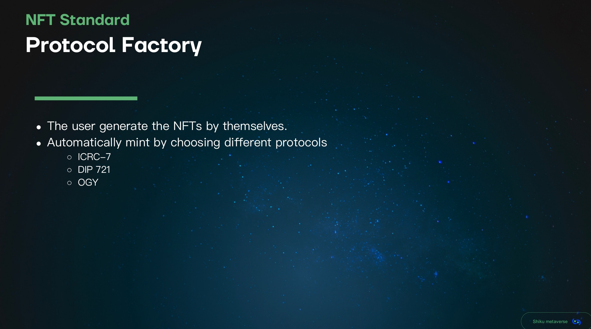
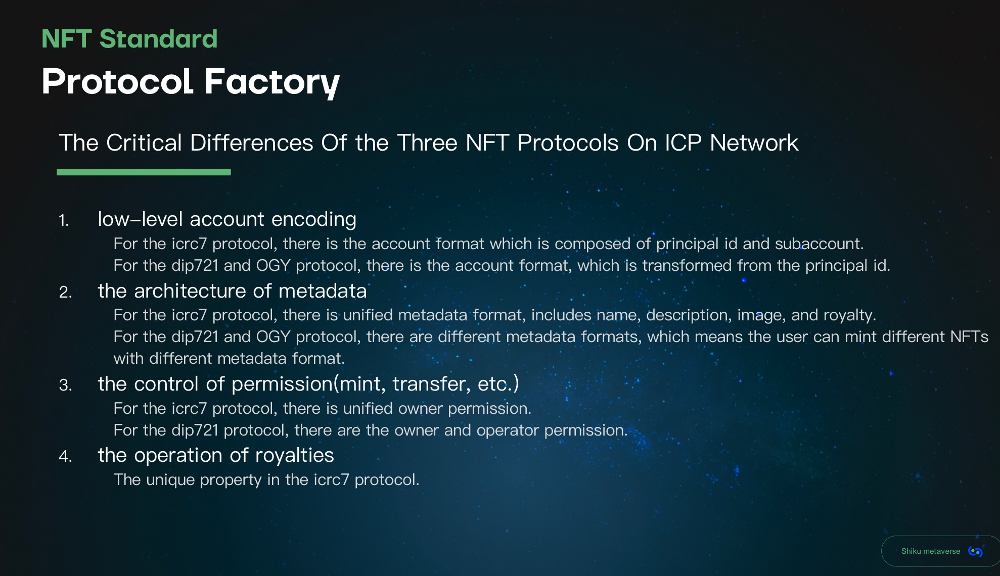
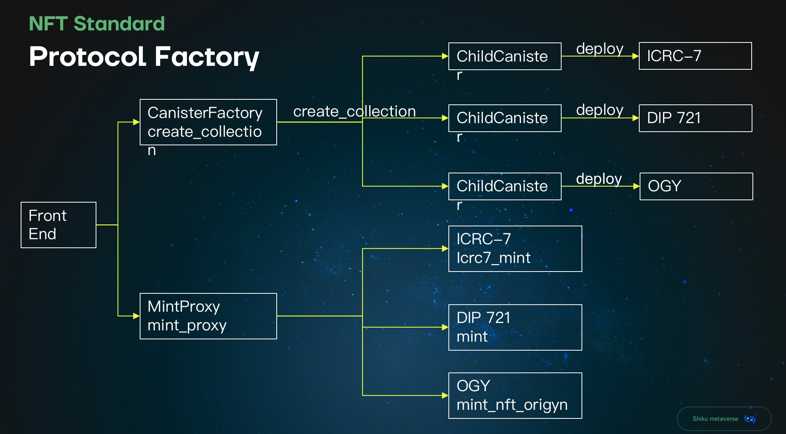

# icrc7
---
## note
- This project was written taking reference of [icrc7](https://github.com/dfinity/ICRC/blob/main/ICRCs/ICRC-7/ICRC-7.md)
## Architecture



## Features
- [x] Stable Memory
- [x] Pre and Post upgrading
- [x] Transaction Deduplication

<strong>Remaining/</strong>
- [ ] Chunk Upload for larger images
- [ ] Transaction Log with filters
- [ ] HTTP Handling

## Running the project locally

If you want to test your project locally, you can use the following commands:

```bash
# Build the project
chmod +x scripts/build.sh
./scripts/build.sh

# Starts the replica, running in the background
dfx start --background

# Sets minting authority
export MINTING_AUTHORITY=$(dfx identity get-principal)

# Deploys your canisters to the replica and generates your candid interface
dfx deploy icrc7 --argument '(record {
  tx_window=24;
  permitted_drift=2;
  name="Icrc7 Token";
  symbol="ICRC7";
  minting_authority=opt principal"'${MINTING_AUTHORITY}'";
  royalties=null;
  royalties_recipient=null;    
  description=opt "ICRC7 Standard Token";
  image=null;    
  supply_cap=null;    
})'

# Mints token
dfx canister call icrc7 icrc7_mint '(record{
  id=100;
  name="Icrc7 100";
  description=opt "100th token of the collection";
  image=null;
  to=record{
  owner=principal"2vxsx-fae";
  subaccount=null;
  };
})'

# Returns owner of
dfx canister call icrc7 icrc7_owner_of '(100)'
```
